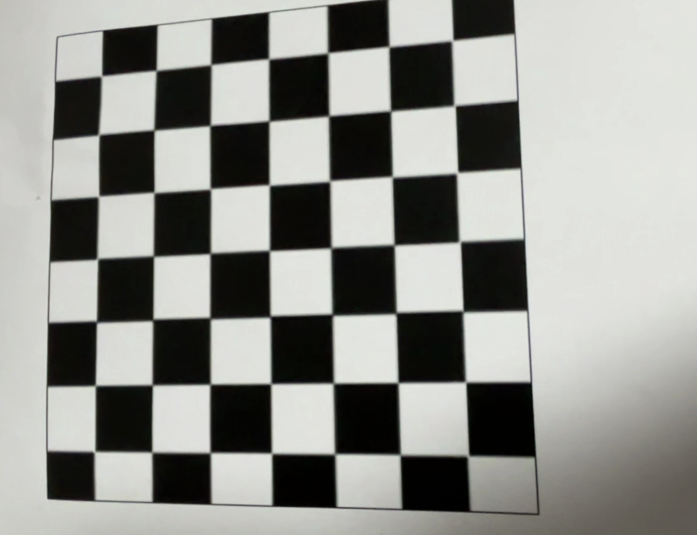

# 🎥 동영상 렌즈 왜곡 보정 프로그램

이 프로젝트는 카메라 렌즈 왜곡 보정을 위해 체커보드판을 촬영한 동영상을 이용하여 카메라 캘리브레이션을 수행하고,
보정 동영상을 생성합니다. OpenCV를 이용하여 실시간으로 Camera Calibration을 확인하고, 렌즈 왜곡 보정을 진행합니다.

---

## ⚙️ 설정 파라미터

| 파라미터 | 설명 |
|------------------|---------|
| `board_pattern`  | 체스보드 패턴 크기 (7x7) |
| `board_cellsize` | 각 셀 사이즈 (m) |
| `select_all`     | 체스보드가 검색된 프레임 자동선택 여부 |

---

## 📐 카메라 캘리브레이션 결과

| 파라미터 | 값 |
|------------------|------|
| **fx** (focal x) | `812.34` |
| **fy** (focal y) | `810.27` |
| **cx** (center x)| `635.89` |
| **cy** (center y)| `360.15` |
| **왜곡 계수** | `[-0.321, 0.101, -0.0008, 0.0003, -0.020]` |
| **재투영 오차 (RMSE)** | `0.23` |

> 해당 값은 `video.mp4`에서 선택된 프레임을 기반으로 계산된 값입니다.

---

## 🎞️ 보정 동영상 미리보기

다음은 보정 시간 동영상 결과 스크린 샷입니다:

****

---

## 실행 방법

1. camera calibration이 적용된 동영상이 재생되는 동안
sample frame을 추출할 부분에서 space bar를 눌러 여러개의 
sample frames를 설정합니다.

2. ESC 키를 누르면 camera calibration은 종료되고,
설정된 sample frames로 만들어진
왜곡보정동영상이 재생됩니다.

3. ESC 키를 누르면 종료됩니다.

---

## 문제점

1. sample frame을 수동으로 설정해야 하기 때문에 
완벽하지 않은 왜곡보정영상이 나올 수 있습니다.

2. 동영상의 화질이 낮으면 corner를 찾기 힘들기 때문에
camera calibration이 잘 되지 않을 수 있습니다.

3. 동영상의 화질이 높거나 프레임수가 많거나 하는
동영상의 품질이 높을 경우 속도가 느릴 수 있습니다.

---

## 해결방안

1. sample frame을 20 ~ 40개 정도로 설정하고 적용합니다.

2. 너무 낮지 않은 동영상을 쓰거나 (480/640 이상)
gaussian blur필터를 적용한 후 코드를 진행합니다.

3. 동영상을 입력받을 때,
동영상의 품질을 낮추는 코드를 적용합니다.